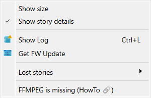
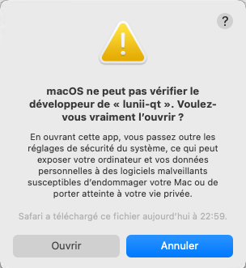
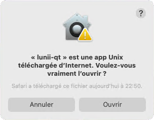

:fr: [README en français](README_FR.md) :fr:

# Lunii.QT
A Python QT app to manage <u>Lunii</u> and <u>Flam</u> Storytellers, including **reorder** / **import** / **export** / **hide** / **firmware download**   
for Windows / Linux / macOS  
(compatible with STUdio archive, **with** transcoding)

### ⚠️ Lunii v3 & Firmware 3.2.x ⚠️

Lunii.QT has been updated to support the latest firmware (3.2.2 and later). This is only a quick and dirty workaround to keep support of custom story. A deeper analysis might reveal a simpler solution in a future update.

> **Reminder :** Keep your v3 Firmware files safe (you can always downgrade) and keep away from automatic upgrades

There are **two solutions** to ensure compatibility and keep your stories safe:

1. **Keep your previous `.md` file:**  
   If you already have a backup of your device's `.md` file from before the upgrade, simply keep it safe somewhere (it is a hidden file located in root dir—so you might need to change your file explorer settings to reveal it) **and** copy/rename it to `SNU.md`, into your user's directory in `.lunii-qt` (e.g. `%HOME%\.lunii-qt\23023030012345.md` on Windows or `$HOME/.lunii-qt/23023030012345.md` on Linux/macOS). This will allow Lunii.QT to continue managing your stories as before.  
   You can eventually try using [Recuva](http://www.recuva.fr/) tool to recover old `.md` file from a very recent update.
2. **Download the upgrade file `fa.bin`:**  
   If you do not have the previous `.md` file, you can download the firmware upgrade file `fa.bin` using Lunii.QT (see [Firmware upgrade](#firmware-upgrade) section above, specifically the [HowTo - Lunii](#howto---lunii) instructions).  
   Rename it to `fa.SNU.v3xx.bin` (with the correct snu and version e.g: `fa.23023030012345.v322.bin`) and place it in your user's directory in `.lunii-qt` (e.g. `%HOME%\.lunii-qt\` on Windows or `$HOME/.lunii-qt/` on Linux/macOS).  
   ⚠️ **Using a new firmware release (e.g 3.3.0) as a 3.2.2 or a firmware from another Lunii won't be detected, and imported stories won't work.**

At least one of those files must be present in your user's `.lunii-qt` directory for Lunii.QT to support import feature with firmware 3.2.2 and later.

> **Note:** If this procedure was not correctly followed, the Log window in the application will provide more details to help you understand and resolve any issues.

> **Important:**  
> When Lunii releases a new firmware version, Lunii.QT itself may need to be updated to support it. However, if one of the required files (`SNU.md` or `fa.SNU.3xx.bin`) is available and import is working, any subsequent firmware update should be transparent to the user—no further action is needed unless compatibility issues arise. **SNU** is the unique Lunii identifier written on the device itself or available in the status bar of the application.

There is a third and forth solution, but I'm pretty sure no one will support it (if you do, leave a message)

3. **Downgrade your firmware 😎**:  
   If you have been playing safe and downloaded your previous firmwares with this app, you can simply push it to the Lunii root dir and downgrade the firmware. You'll get back to a working device. 
4. **Using your own device keys 😎😎**

### Hardware supported:
* **v1, v2**  (full Support)
* **v3**  (export requires device key file)  
* **Flam** (partial support, only reorder and firmware backup)

### Limitations
* Application <u>no longer</u> allows Official stories to be exported
* Audio transcoding requires FFMPEG v6 to be present ([more details](#audio-transcoding))

### Table of contents
<!-- TOC -->
* [Lunii.QT](#luniiqt)
  * [User Interface](#user-interface)
  * [Shortcuts](#shortcuts)
  * [Features](#features)
  * [Audio Transcoding](#audio-transcoding)
    * [Installation](#installation)
    * [Checking](#checking-)
  * [Firmware upgrade](#firmware-upgrade)
    * [HowTo - Lunii](#howto---lunii)
    * [HowTo - Flam](#howto---flam)
  * [Supported archive formats (Lunii)](#supported-archive-formats-lunii)
  * [Python ? HowTo](#python--howto)
  * [Tricks](#tricks)
    * [macOS - Application Authorization](#macos---application-authorization)
    * [Third Party story metadata](#third-party-story-metadata)
    * [Cache management](#cache-management)
    * [Linux Missing dependencies](#linux-missing-dependencies)
  * [Credits](#credits)
* [Links / Similar repos](#links--similar-repos)
<!-- TOC -->


## User Interface

  

 .  
  
  


### Description

  

1. The **menu bar**. It will notify you when an update is available  
   (just get it with Menu About/Update to v2.X.X)
2. The **location of your Lunii/Flam** when it's connected.   
   The button on the left updates automatic detection.
3. **Official DB refresh** : Updates the list of stories and related information from the official Lunii Store. Use it when some official are not recognized.
4. The **list of your stories** with UUID and Database (DB) origin.  
   The UUID: This unique identifier allows you to associate stories with their folder on the Lunii, thanks to the last eight characters that make up the name of the folder associated with that story.

   * **DB** stands for **Database**. This application supports two different databases
     - **O** - Lunii **O**fficial Database  
        _(all metadata are fed from Lunii servers)_
     - **T** - **T**hirdparty Database, also known as Unofficial or Custom Stories  
        _(Those metadata can't be fetched. They are completed upon story import)_


5. The **status bar**, you'll find 
   * your SNU (serial number)
   * the firmware version of your Lunii/Flam
   * the available space  
   * the number of stories it contains

6. **Hidden stories** (greyed items in the list) are still stored on the device, but won't be visible by Luniistore app. That will avoid getting third party stories to be removed during synchronization. Just remember to hide them before hitting sync button !

## Shortcuts

| Keys           | Actions                          |
|----------------|----------------------------------|
| `Ctrl+Up`      | Move the selected item(s) Top    |
| `Alt+Up`       | Move the selected item(s) Up     |
| `Alt+Down`     | Move the selected item(s) Down   |
| `Ctrl+Down`    | Move the selected item(s) Bottom |
|                |                                  |
| `Ctrl+I`       | Import new story                 |
| `Ctrl+S`       | Export the selection             |
| `Ctrl+Shift+S` | Export all the stories           |
| `Ctrl+H`       | Hide/Show selected stories       |
| `Delete`       | Remove the selected item(s)      |
|                |                                  |
| `Ctrl+O`       | Open a Lunii/Flam device         |
| `Ctrl+L`       | Open debug log window            |
| `Ctrl+Q`       | Exit the application             |
| `F1`           | About the app                    |
| `F5`           | Refresh devices                  |

## Features
* Automatic **Update** detection
* **Import** / **Export** / **Remove** stories
* Support **STUdio** archive formats, and **import STUdio database**
* **Reorganize** the stories in the order you want
* **Hide** stories  
  In order to avoid stories to get removed by Luniistore PC Synchronization, you can temporary hide them (all files ares kept on device), sync, and revert hide.
* **Lost Stories**  
  Three tools are offered to manage "crashed" stories on your device.   
 
  You can :
  * List them  
  _(app will try to fix broken stories, in particular auth files on v1/v2)_
  * Recover them (if they are complete)
  * Remove them (**be careful, files will be deleted**)  
* **Get Firmware**  for your device (refer [this section](#firmware-upgrade))

## Audio Transcoding
Some third-party stories are using non MP3 files. Thus they can't be installed as it is on Lunii. It requires a **transcoding** step. This extra process is done using **FFMPEG** tool ( [https://ffmpeg.org/download.html](https://ffmpeg.org/download.html) )

**WARNING** : transcoding is <u>very long</u>, you should be patient. That's why you should prefer the [.plain.pk](#plainpk) format that use compatible audio.

### Installation
#### Windows

**NOTE :** By default, from now on, the Windows portable and MSI will embed FFMPEG 6.1.1   
  
Procedure:
1) grab your ffmpeg release from [here](https://www.gyan.dev/ffmpeg/builds/)
2) rename it to `ffmpeg.exe`
3) copy beside lunii-qt.exe   
    ```
    - 
     |- lunii-qt.exe
     |- ffmpeg.exe
    ```
4) restart luni-qt

Alternate method (I prefer):
1) open powershell terminal
2) run the following commands to install Scoop Package manager  
    ```powershell
    Set-ExecutionPolicy -ExecutionPolicy RemoteSigned -Scope CurrentUser
    Invoke-RestMethod -Uri https://get.scoop.sh | Invoke-Expression
    ```
3) install ffmpeg with   
  `scoop install ffmpeg`
4) restart luni-qt

#### Linux
1) open a terminal
2) run following command :   
`sudo apt-get install ffmpeg`
4) restart luni-qt

#### macOS
To ease ffmpeg tool installation, it is recommended to use Brew from https://brew.sh/  
1) open a terminal
2) copy and paste the following link  
`/bin/bash -c "$(curl -fsSL https://raw.githubusercontent.com/Homebrew/install/HEAD/install.sh)"`
3) At the end of the installation, type into the terminal:  
`brew install ffmpeg`
4) restart luni-qt


### Checking 
Within the application, the Tools menu will display the status of detection.
#### Not found
  
#### Found


## Firmware upgrade

Lunii.QT offers you the possibility to backup and upgrade your Firmware without connecting to LuniiStore (you won't lost your non official loaded stories). This procedure is experimental but so far no one faced issues.

**NOTE 1:** Remember to keep a backup of your firmware for Lunii v3 and FLAMs, in cas of a release that would break to third party stories trick. <u>You will be able to downgrade.</u>  
**NOTE 2:** You cannot choose the firmware version. You'll only get the latest available from Lunii servers.


### HowTo - Lunii
1. Select a Lunii/Flam device
2. Menu **Tools/Get FW Update**
3. You'll be prompted for login entry  


4. Enter your Luniistore credentials (they are not saved for security purpose).  
   You can verify this point here
   https://github.com/o-daneel/Lunii.QT/blob/a8bd30e1864552687f235004085a417d7c6b00e6/pkg/main_window.py#L468-L475
5. Pick a location where to save your firmware(s) (there are two for Lunii v1)
6. Copy it to the root dir of your device
7. Rename it to `fa.bin` (and optionnally  `fu.bin` for Lunii v1)   
```
- 
 |- .contents
 |- .md
 |- .pi
 |- fa.bin
 |- ... (other files)
```
8. Power OFF, Power ON, Wait : **TADA**  
   (if you reconnect your lunii on your pc, the `fa.bin` should have been removed)


### HowTo - Flam
1. Select a Flam device
2. Menu **Tools/Get FW** Update
3. You'll be prompted for login entry  


4. Enter your Luniistore credentials (they are not saved for security purpose).  
   You can verify this point here
   https://github.com/o-daneel/Lunii.QT/blob/a8bd30e1864552687f235004085a417d7c6b00e6/pkg/main_window.py#L468-L475
5. Pick a location where to save your firmwares (`update-main.enc` and `update-comm.enc`)
6. Copy them to the root dir of your device   
```
- 
 |- etc/
 |- str/
 |- .mdf
 |- update-main.enc
 |- update-comm.enc
 |- ... (other files)
```
7. Create an empty file `cable_update_complete` in /tmp
```
- 
 |- etc/
 |- str/
 |- .mdf
 |- update-main.enc
 |- update-comm.enc
 |- tmp/
   |- cable_update_complete
 |- ... (other files)
```
8. Eject USB from Flam device (USB cable must be kept connected) and update process will start : **TADA**  
   (if you reconnect your flam on your pc, the `*.enc` should have been removed)

## Supported archive formats (Lunii)
**NOTE :** Flam stories are not yet supported
### .plain.pk
**Filename** :  `story_name.8B_UUID.plain.pk`  
**Ciphering** : None / Plain  
**Structure** :  

      uuid.bin
      ni
      li.plain
      ri.plain
      si.plain
      rf/000/XXYYXXYY.bmp
      sf/000/XXYYXXYY.mp3
### .v1.pk / .v2.pk
**Filename** :  
* `LONG_UUID.v2.pk`  
* `LONG_UUID.v2.pk`  
* `LONG_UUID.pk`  
  
**Ciphering** : Generic Key  
**Structure** :  

      00000000000000000000000000000000/ni
      00000000000000000000000000000000/li
      00000000000000000000000000000000/ri
      00000000000000000000000000000000/si
      00000000000000000000000000000000/rf/000/XXYYXXYY
      00000000000000000000000000000000/sf/000/XXYYXXYY
### ZIP (old Lunii.QT)
**Filename** :  `8B_UUID - story_name.zip`  
**Ciphering** : Generic Key  
**Structure** :  

      uuid.bin
      ni
      li
      ri
      si
      rf/000/XXYYXXYY
      sf/000/XXYYXXYY

### ZIP (alternate)
**Filename** :  `AGE+] story_title DASHED_UUID.zip`  
**Ciphering** : Generic Key  
**Structure** : (same as [.v1.pk / .v2.pk](#v1pk--v2pk))

      00000000-0000-0000-0000-000000000000/ni
      00000000-0000-0000-0000-000000000000/li
      00000000-0000-0000-0000-000000000000/ri
      00000000-0000-0000-0000-000000000000/si
      00000000-0000-0000-0000-000000000000/rf/000/XXYYXXYY
      00000000-0000-0000-0000-000000000000/sf/000/XXYYXXYY

### 7z
**Filename** : `AGE+] story_title DASHED_UUID.7z`  
**Ciphering** : Generic Key  
**Structure** :  

      00000000-0000-0000-0000-000000000000/ni
      00000000-0000-0000-0000-000000000000/li
      00000000-0000-0000-0000-000000000000/ri
      00000000-0000-0000-0000-000000000000/si
      00000000-0000-0000-0000-000000000000/rf/000/XXYYXXYY
      00000000-0000-0000-0000-000000000000/sf/000/XXYYXXYY

### STUdio (ZIP / 7z)
**Filename** : `AGE+] story_title DASHED_UUID.zip .7z`  
**Ciphering** : None  

**Structure** :  

        assets/
        stroy.json
        thumbnail.png


## Python ? HowTo

### Prepare env

First, clone the git repo   
Prepare a Virtual environment for your project and install requirements
```bash
$ python3 -m venv venv
```

Switch to your venv 
* on Linux   
   `source venv/bin/activate`
* on Windows   
  `.\venv\Scripts\activate.bat`

Install dependencies
****```
$ pip install -r requirements.txt
```

**Linux** has one more extra dependency to be installed  

```bash
$ apt install libxcb-cursor0
```
### Build UI files
```bash
$ pyside6-uic pkg/ui/main.ui -o pkg/ui/main_ui.py
$ pyside6-rcc resources.qrc -o resources_rc.py
```
### Run
```bash
$ python lunii-qt.py
```

### Build GUI executable
**NOTE :** PyInstaller by its design generates executables that are flagged by AntiViruses. Those are false positives. cx_Freeze is an alternative that allows to avoid such false positives.

#### PyInstaller 👎
``` bash
$ pip install pyinstaller
$ pyinstaller lunii-qt.spec
...
$ dist\lunii-qt
```

#### cx_Freeze 👍
```bash
$ pip install cx_Freeze
$ python setup.py build_exe
...
$ build/exe.win-amd64/lunii-qt
```

## Tricks

### macOS - Application Authorization
1. Double-click the file called `lunii-qt`.
2. You should see an error message "`lunii-qt` can’t be opened because it is from an unidentified developer".  
  
  Click "**OK**"
3. Go to System **Preferences** > **Security** and **Privacy** and click on the General tab.  

4. At the bottom of the window you will see a message saying that `lunii-qt` was blocked. Click "**Open Anyway**".   
   If you do not see this message in the General tab, double-click `lunii-qt` again.  
   **NOTE :** You may have to click the "**unlock**" button and enter your password to be able to click "**Open Anyway**".
8. If you see another popup that says “`lunii-qt` is from an unidentified developer. Are you sure you want to open it?”, click "**Open**". If you don’t get this popup, just go to the same file and double-click it again.    

9. Finally, you'll be informed that `lunii-qt` was downloaded from internet     
  
Click "**Open**", and you'll never get these messages in the future. 

### Third Party story metadata
You might have already loaded non-official stories to your device thanks to another app. When opening Lunii.QT, this 
story will appear as `Unknown story (maybe a User created story)...`.   
You can easily fix that by :  
1. Importing STUdio DB with menu `File/Import STUdio DB`
2. Dropping the corresponding archive as you'll do for loading.  
Lunii.QT will **only read the metadata** and add them locally, **skipping the rest** of the archive.


### Cache management
This application will download once for all the official story database and any request pictures to the application dedicated folder
* `$HOME/.lunii-qt/official.db`
* `$HOME/.lunii-qt/cache/*`

In case of any trouble, just remove this file and directory to force refresh

### Linux missing dependencies
If you encounter the following error when launching Lunii.QT on Linux:

```
qt.qpa.plugin: Could not load the Qt platform plugin "xcb" in "" even though it was found.
This application failed to start because no Qt platform plugin could be initialized. Reinstalling the application may fix this problem.

Available platform plugins are: offscreen, vkkhrdisplay, xcb, minimalegl, vnc, eglfs, minimal, linuxfb, wayland-egl, wayland.
```

This means that a required system library for the Qt graphical interface is missing.

**Solution:**  
Install the missing dependency by running the following command in your terminal:

```bash
sudo apt install libxcb-cursor0
```

After installing, try launching Lunii.QT again.  
If you still experience issues, make sure all other Qt dependencies are installed.

### v3 export
In order to suport story export from Lunii v3 hardware, you must place your device keys in here :
```bash
%HOME%\.lunii-qt\230230300XXXXX.keys
$HOME/.lunii-qt/230230300XXXXX.keys
```
It is a binary file with 0x10 bytes for Key and 0x10 bytes for IV
### ICO creation
```bash
magick convert logo.png -define icon:auto-resize="256,128,96,64,48,32,16"  logo.ico
```

## Credits
Thanks to :
* **olup** for STUdio archive format 
* **sniperflo** for v1 support, MacOs support & debug 
* **McFlyPartages** for Linux debug and other contributions 

# Links / Similar repos
* [Lunii v3 - Reverse Engineering](https://github.com/o-daneel/Lunii_v3.RE)
* [Lunii CLI tool](https://github.com/o-daneel/Lunii.PACKS)
* [STUdio - Story Teller Unleashed](https://marian-m12l.github.io/studio-website/)
* [(GitHub) STUdio, Story Teller Unleashed](https://github.com/marian-m12l/studio)
* [Lunii Admin](https://github.com/olup/lunii-admin) (a GO implementation of a STUdio alternative)
* [Lunii Admin Web](https://github.com/olup/lunii-admin) (same as previous but from a browser)  
* Icon trick for workflow using **[rcedit](https://github.com/electron/rcedit)**
